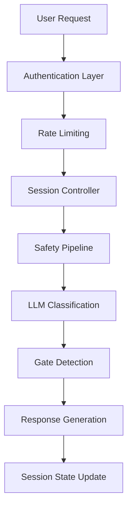
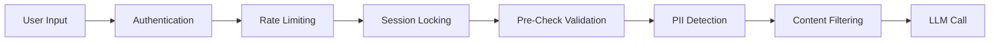
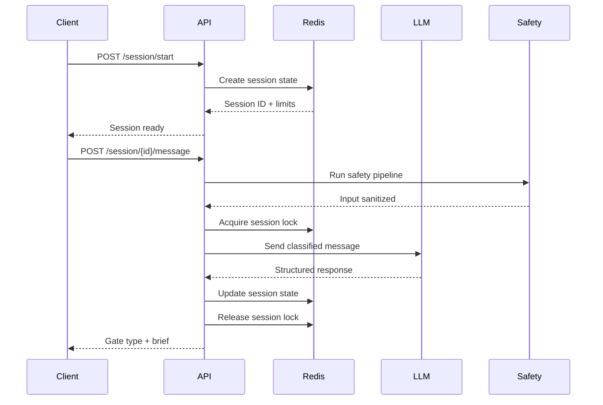

# Afloat

A no-fluff cognitive assistant with dynamic Ollama-first routing. Get past context gates in under 2 minutes.

## What It Does

You describe what you're stuck on. Afloat identifies the block type (meeting triage, priority decision, quick briefing, or context gate resolution), gives you a short honest brief, and lets you ask one follow-up. Session over.

## Tech Stack

| Layer         | Technology                                                         |
| ------------- | ------------------------------------------------------------------ |
| Framework     | Next.js 16 (App Router, TypeScript)                                |
| LLM           | Ollama-first dynamic routing, optional OpenAI lifeguard escalation |
| Session Store | Upstash Redis                                                      |
| Payment       | Stripe ($3/mo subscription)                                        |
| Auth          | JWT (jose)                                                         |
| Rate Limiting | @upstash/ratelimit                                                 |
| Hosting       | Vercel (free tier)                                                 |

## Security guardrails

Auth, rate limits, webhook signature verification, and no-debug-in-production enforcement. See `docs/SAFETY_CORE.md` for the safety pipeline model.

## Prerequisites

- **Node.js**: Version 20.x or higher
- **Redis**: Upstash Redis account (for session storage)
- **Stripe**: Account with webhook configuration
- **Ollama**: Local or remote Ollama endpoint
- **OpenAI**: Optional API key for rare deep-read lifeguard escalation
- **Git**: For version control

## Setup

```bash
# 1. Clone and install
git clone https://github.com/caraxesthebloodwyrm02/afloat.git
cd afloat
npm install

# 2. Configure environment
cp .env.example .env.local
# Fill in the required values in .env.local

# 3. Verify environment variables
# Ensure you have the required variables from the table below
#特别注意: JWT_SECRET and PROVENANCE_SIGNING_KEY must be different

# 4. Run locally
npm run dev
```

## Quality Gates

- `npm run lint` - ESLint across the repo
- `npm run typecheck` - strict TypeScript validation
- `npm run test` - Vitest suite
- `npm run test:routing` - focused routing, adapter, and request-contract coverage
- `npm run test:smoke` - targeted route/configuration smoke coverage
- `npm run test:coverage` - Vitest with enforced coverage thresholds
- `npm run build` - production build verification
- `npm run check` - full local PR gate (`lint`, `typecheck`, `test:coverage`, `test:smoke`, `build`)

## CI/CD And Governance

- Pull requests to `main` run lint, typecheck, coverage-backed tests, smoke tests, and build in `.github/workflows/ci-cd.yml`
- Security automation runs TruffleHog, `npm audit --omit=dev --audit-level=high`, and CodeQL in `.github/workflows/security.yml`
- Dependency updates are managed through `.github/dependabot.yml`
- Reviews can be required through `.github/CODEOWNERS`
- PRs should follow `.github/pull_request_template.md`

### Environment Setup Notes

- **JWT_SECRET**: Use a cryptographically secure random string (32+ chars)
- **PROVENANCE_SIGNING_KEY**: Use a different random string than JWT_SECRET
- **CRON_SECRET**: Required for automated cleanup jobs in production
- **PHASE4_MESSAGE_CAPABILITY_ENABLED**: Keep `false` for initial setup
- **OLLAMA_BASE_URL**: Set to your local or remote Ollama endpoint
- **OLLAMA_API_KEY**: Optional, only needed when Ollama sits behind auth
- **Stripe Webhooks**: Configure endpoint `https://your-domain.com/api/v1/webhooks/stripe`

### Required Environment Variables

| Variable                            | Purpose                                                |
| ----------------------------------- | ------------------------------------------------------ |
| `OLLAMA_BASE_URL`                   | Ollama endpoint base URL                               |
| `UPSTASH_REDIS_REST_URL`            | Upstash Redis connection URL                           |
| `UPSTASH_REDIS_REST_TOKEN`          | Upstash Redis auth token                               |
| `JWT_SECRET`                        | Secret for signing JWTs                                |
| `STRIPE_SECRET_KEY`                 | Stripe API secret key                                  |
| `STRIPE_PUBLISHABLE_KEY`            | Stripe publishable key                                 |
| `STRIPE_WEBHOOK_SECRET`             | Stripe webhook signing secret                          |
| `STRIPE_PRICE_ID`                   | Stripe price ID for the $3/mo trial plan               |
| `STRIPE_CONTINUOUS_PRICE_ID`        | Stripe price ID for continuous tier                    |
| `STRIPE_METER_EVENT_NAME`           | Stripe meter event for usage billing                   |
| `PROVENANCE_SIGNING_KEY`            | Signing key for audit trail integrity                  |
| `NEXT_PUBLIC_APP_URL`               | App URL (e.g. `https://your-app.vercel.app`)           |
| `PHASE4_MESSAGE_CAPABILITY_ENABLED` | Feature flag for Phase 4 capabilities (default: false) |
| `CRON_SECRET`                       | Bearer token for cron job authentication               |

**Total Required Variables**: 14

**Optional**

| Variable                   | Purpose                                                                                                                                                               |
| -------------------------- | --------------------------------------------------------------------------------------------------------------------------------------------------------------------- |
| `OLLAMA_API_KEY`           | Token for authenticated Ollama endpoints                                                                                                                              |
| `OLLAMA_AUTH_HEADER`       | Custom auth header name for Ollama gateways                                                                                                                           |
| `OLLAMA_AUTH_SCHEME`       | Auth scheme for Ollama gateways (`Bearer` by default, `none` for raw value)                                                                                           |
| `OPENAI_API_KEY`           | Optional OpenAI API key for rare lifeguard escalation                                                                                                                 |
| `OPENAI_LIFEGUARD_ENABLED` | Warn if OpenAI lifeguard is intended but key is missing                                                                                                               |
| `OPENAI_LIFEGUARD_MODEL`   | Override the rare lifeguard model (defaults to `gpt-5.4`)                                                                                                             |
| `ALLOWED_CALLERS`          | Comma-separated list of identities (e.g. `user_id`) allowed to call protected operations. If unset, all authenticated callers are allowed. See `docs/SAFETY_CORE.md`. |

## API Routes

| Method   | Path                              | Purpose                          | Auth         |
| -------- | --------------------------------- | -------------------------------- | ------------ |
| `GET`    | `/api/v1/health`                  | Health check                     | No           |
| `POST`   | `/api/v1/session/start`           | Start session                    | JWT          |
| `POST`   | `/api/v1/session/{id}/message`    | Send message                     | JWT          |
| `POST`   | `/api/v1/session/{id}/end`        | End session                      | JWT          |
| `POST`   | `/api/v1/subscribe`               | Create Stripe checkout           | No           |
| `POST`   | `/api/v1/subscribe/verify`        | Verify checkout + issue JWT      | No           |
| `POST`   | `/api/v1/user/consent`            | Update consent preferences       | JWT          |
| `GET`    | `/api/v1/user/data-export`        | Export user data                 | JWT          |
| `DELETE` | `/api/v1/user/data`               | Request data deletion            | JWT          |
| `PATCH`  | `/api/v1/user/profile`            | Update display name / email pref | JWT          |
| `GET`    | `/api/v1/provenance/session/{id}` | Get session provenance chain     | JWT          |
| `GET`    | `/api/v1/provenance/verify/{id}`  | Verify session chain integrity   | JWT          |
| `POST`   | `/api/v1/webhooks/stripe`         | Stripe webhook receiver          | Stripe sig   |
| `GET`    | `/api/cron/cleanup`               | Automated data cleanup           | Bearer token |

**Total API Endpoints**: 14 (13 v1 routes + 1 cron endpoint)

## Runtime Routing Controls

The main message route accepts two tool-facing runtime controls:

| Field             | Type                           | Default  | Effect                                                |
| ----------------- | ------------------------------ | -------- | ----------------------------------------------------- |
| `deep_read`       | `boolean`                      | `false`  | Promotes deeper local-model context and token budgets |
| `openai_override` | `"auto" \| "force" \| "never"` | `"auto"` | Controls rare OpenAI lifeguard escalation             |

Notes:

- `allow_routing_memory` is never accepted from the client. The server derives it from stored consent.
- Unknown `openai_override` values normalize to `"auto"`.
- The memory-session placeholder route accepts the same request shape for tooling compatibility, even though it does not yet execute the full router.

### Supported Scenarios

- Default fast help: omit both fields and let the router choose a fast or balanced Ollama model.
- Deep local analysis: set `deep_read: true` with `openai_override: "auto"` to prefer large Ollama models first.
- Forced premium rescue: set `deep_read: true` and `openai_override: "force"` to jump straight to the OpenAI lifeguard.
- Strict local-only mode: set `openai_override: "never"` to block OpenAI escalation even on complex failures.

### API Example

```bash
curl -X POST "$NEXT_PUBLIC_APP_URL/api/v1/session/$SESSION_ID/message" \
  -H "Authorization: Bearer $Afloat_TOKEN" \
  -H "Content-Type: application/json" \
  -d '{
    "message": "Do a deep read on the architecture trade-offs here.",
    "history": [
      { "role": "assistant", "content": "Prior context from the session." }
    ],
    "deep_read": true,
    "openai_override": "auto"
  }'
```

### Tooling Example

```ts
const response = await fetch(`/api/v1/session/${sessionId}/message`, {
  method: 'POST',
  headers: {
    Authorization: `Bearer ${token}`,
    'Content-Type': 'application/json',
  },
  body: JSON.stringify({
    message: 'Do a concise architectural read on this deployment issue.',
    deep_read: false,
    openai_override: 'never',
  }),
});
```

### Authenticated Ollama Examples

Standard bearer auth:

```bash
OLLAMA_BASE_URL=https://ollama.example.com
OLLAMA_API_KEY=replace-with-token
OLLAMA_AUTH_HEADER=Authorization
OLLAMA_AUTH_SCHEME=Bearer
```

Custom header with raw token:

```bash
OLLAMA_BASE_URL=https://ollama.example.com
OLLAMA_API_KEY=replace-with-token
OLLAMA_AUTH_HEADER=X-API-Key
OLLAMA_AUTH_SCHEME=none
```

## Architecture Overview

### Gate Classification System

Afloat uses a **structured LLM classification system** to identify context gates:

```typescript
// System prompt enforces structured response format
[GATE: gate_type_here]
Your proportional brief here. Just enough to unblock the user.
```

**Gate Types:**

- `meeting_triage` - Quick meeting decisions and prioritization
- `priority_decision` - Choice framework for overwhelmed users
- `quick_briefing` - Concise summaries of complex topics
- `context_gate_resolution` - Breaking through analysis paralysis
- `out_of_scope` - Requests outside quick decision support

### Session Management Architecture



**Session Constraints:**

- **Time Limits**: 2 minutes (trial), 30 minutes (continuous tier)
- **Turn Limits**: 2 turns (trial), 6 turns (continuous)
- **Word Limits**: 150 words maximum per response
- **Data Privacy**: Conversation history never persisted to disk

### Multi-Layer Safety System



**Safety Components:**

- **Pre-Check**: Input validation and format checking
- **PII Shield**: Automatic detection and redaction of personal information
- **Content Pipeline**: Multi-stage content safety validation
- **Provenance Tracking**: Immutable audit trail for all decisions

### Core Technical Components

#### Session Controller (`src/lib/session-controller.ts`)

- **Session Lifecycle**: Create, enforce limits, update, cleanup
- **Lock Management**: Prevents concurrent LLM calls per session
- **Turn Tracking**: Records latency and conversation flow
- **Data Isolation**: Strips conversation history before persistence

#### LLM Integration (`src/lib/llm.ts`)

- **Dynamic Routing**: Selects Ollama models by task, complexity, and response scope
- **Routing Memory**: Uses consented cross-session preferences to influence model selection
- **Rare Lifeguard Escalation**: Escalates to OpenAI only for forced or high-complexity deep-read scenarios
- **Structured Parsing**: Extracts gate tags from model responses
- **Quality Assessment**: Word count, format validation
- **Error Handling**: Timeout, rate limiting, and transient failure fallback

#### Safety Pipeline (`src/lib/safety-pipeline.ts`)

- **Unified Interface**: Single entry point for all safety checks
- **Modular Design**: Composable safety stages
- **Telemetry**: Fire-and-forget event recording
- **Graceful Degradation**: Safe fallbacks on pipeline failures

### Data Flow Architecture



### State Management Patterns

#### Session State (`src/types/session.ts`)

```typescript
interface SessionState {
  session_id: string;
  user_id: string;
  tier: string;
  start_time: string;
  llm_call_count: number;
  gate_type: GateType | null;
  latency_per_turn: number[];
  conversation_history: Array<{ role: string; content: string }>;
  session_completed: boolean | null;
  user_proceeded: boolean | null;
  error: string | null;
}
```

#### Provenance Chain (`src/lib/provenance/`)

- **Decision Provenance Records (DPRs)**: Immutable decision audit trail
- **Chain Verification**: Cryptographic integrity validation
- **Safety Verdicts**: Multi-gate safety decision tracking
- **Authority Tracking**: System policy vs. automated decisions

### Performance & Reliability

#### Rate Limiting Strategy

- **Session-based**: Per-user session creation limits
- **Global**: API-wide request throttling
- **Tier-aware**: Different limits by subscription tier
- **Redis-backed**: Distributed rate limiting state

#### Error Handling Patterns

- **Graceful Degradation**: Safe fallbacks for LLM failures
- **User-Friendly Messages**: Clear error descriptions
- **Audit Logging**: All errors recorded for analysis
- **Circuit Breakers**: Automatic retry with backoff

#### Monitoring & Telemetry

- **Latency Tracking**: Per-turn response times
- **Success Rates**: Gate classification accuracy
- **Safety Events**: PII detection, content blocks
- **Session Analytics**: Duration, completion rates

### Security Architecture

#### Authentication & Authorization

- **JWT Tokens**: Stateless session authentication with configurable expiration
- **Middleware Pattern**: Route-level auth enforcement via `auth-middleware.ts`
- **Subscription Validation**: Active status required for session creation
- **Deletion Protection**: Pending deletion account blocking with 7-day grace period
- **Provenance Signing**: Separate `PROVENANCE_SIGNING_KEY` for audit trail integrity

#### Data Protection

- **PII Redaction**: Automatic personal information detection and redaction
- **Data Minimization**: Only essential data persisted, conversation history never stored to disk
- **Right to Deletion**: Complete data removal capability with 7-day grace period
- **Consent Management**: Granular privacy preferences via consent management system
- **Retention Policy**: 90-day session log retention with automated cleanup

#### Infrastructure Security

- **Environment Variables**: All secrets in environment with secure defaults
- **Vercel Integration**: Secure deployment pipeline with environment isolation
- **Stripe Webhooks**: Signature-verified payment processing
- **Redis Security**: TLS-encrypted session storage with Upstash
- **Cron Security**: Bearer token authentication for automated cleanup jobs

## Project Structure

```
src/
├── app/                  # Next.js pages and API routes
│   ├── api/               # API endpoints
│   │   ├── cron/          # Automated cleanup jobs
│   │   └── v1/            # 13 API route handlers
│   ├── chat/              # Chat UI (subscribers)
│   ├── consent/           # Post-signup consent form (CM-01)
│   ├── settings/          # Consent toggles + data rights (CM-02)
│   ├── subscribe/         # Subscribe flow + success page
│   └── privacy/           # Privacy policy
├── components/            # Chat window, input, timer, status
├── lib/                   # Server-side logic
│   ├── session-controller.ts   # Turn + timer enforcement
│   ├── llm.ts                  # Ollama-first router + rare OpenAI lifeguard
│   ├── session-message-request.ts # Shared message request normalization
│   ├── prompt.ts               # System prompt
│   ├── redis.ts                # Upstash Redis client
│   ├── auth.ts                 # JWT create/verify
│   ├── auth-middleware.ts      # Route-level JWT validation
│   ├── rate-limit.ts           # Rate limiter
│   ├── data-layer.ts           # Session logs, user store
│   ├── audit.ts                # Immutable audit log
│   ├── consent.ts              # Consent management
│   ├── safety.ts               # Core safety logic
│   ├── safety-pipeline.ts      # Unified safety interface
│   ├── safety-telemetry.ts     # Safety event recording
│   ├── provenance/             # Decision audit trail
│   └── stripe.ts               # Stripe client
└── types/                 # TypeScript type definitions
```

## Operations & Maintenance

### Automated Systems

#### Cron Job Cleanup

- **Endpoint**: `GET /api/cron/cleanup`
- **Authentication**: Bearer token via `CRON_SECRET`
- **Frequency**: Daily automated execution
- **Functions**:
  - Process pending user deletions after 7-day grace period
  - Clean up session logs past 90-day retention
  - Generate audit logs for all cleanup actions

#### Data Retention Policies

- **Session Logs**: 90-day automatic retention with daily cleanup
- **User Data**: Immediate deletion after 7-day grace period
- **Conversation History**: Never persisted to disk (in-memory only)
- **Audit Trails**: Immutable provenance chains with cryptographic integrity

### Feature Flags

#### Phase-Based Rollouts

- `PHASE4_MESSAGE_CAPABILITY_ENABLED` - Controls advanced messaging features
- Default: `false` (disabled)
- Environment-specific configuration recommended
- Monitor performance metrics before enabling

#### Rate Limiting Tiers

- **Session Rate Limiting**: Per-user session creation throttling
- **Data Rights Rate Limiting**: Separate limits for data export/deletion requests
- **Tier-Aware Limits**: Different thresholds for trial vs continuous subscribers
- **Redis-Backed**: Distributed state management for scalability

### Development Workflow

```bash
# Testing
npm run test              # Run all tests once
npm run test:watch         # Run tests in watch mode

# Code Quality
npm run lint               # Run ESLint
npm run build              # Production build

# Local Development
npm run dev                # Start development server
npm run start              # Start production server
```

### Troubleshooting

#### Common Setup Issues

- **Missing Environment Variables**: Verify all 14 variables in .env.local
- **Redis Connection**: Check Upstash Redis URL and token validity
- **Stripe Integration**: Ensure webhook endpoint is accessible and configured
- **JWT Errors**: Verify `JWT_SECRET` and `PROVENANCE_SIGNING_KEY` are different
- **Cron Job Failures**: Check `CRON_SECRET` matches deployment configuration

#### Performance Monitoring

- **Response Latency**: Target ≤ 3.0 seconds per turn
- **Session Success Rate**: Monitor ≥ 95% completion rate
- **Gate Classification**: Track ≥ 70% accuracy for context identification
- **Safety Events**: Monitor PII detection and content filtering rates

## Contract Reference

The design spec lives in a separate contract repo (`e:\assistive-tool-contract`):

- `contract.json` v1.4.0 — source of truth
- `ARCHITECTURE.md` — 11-section system design
- `BUILD_GUIDE.md` — 9-step build sequence
- `BUILD_MAP.md` — file-level implementation blueprint

## KPI Baselines

| Metric                 | Target         |
| ---------------------- | -------------- |
| Session success rate   | >= 95%         |
| Response latency       | <= 3.0 seconds |
| Context gate pass rate | >= 70%         |
| Avg session duration   | <= 2.0 minutes |
| Net revenue (90 days)  | >= $22.00 USD  |

# CI verified with secrets
