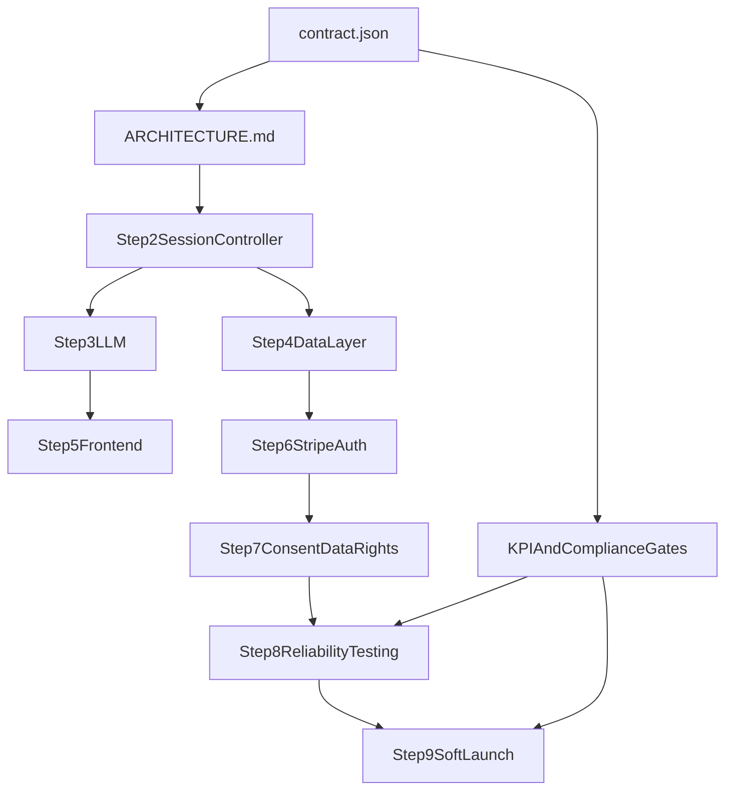

# Afloat Reference-Track Build Map

## Reference Track (Canonical Inputs)

Use these as the authoritative baseline for implementation sequencing and acceptance criteria:

- [E:/assistive-tool-contract/contract.json](E:/assistive-tool-contract/contract.json)
- [E:/assistive-tool-contract/ARCHITECTURE.md](E:/assistive-tool-contract/ARCHITECTURE.md)
- [E:/assistive-tool-contract/BUILD_GUIDE.md](E:/assistive-tool-contract/BUILD_GUIDE.md)
- [E:/assistive-tool-contract/CONTRACT_LAUNCH_CHECKLIST.md](E:/assistive-tool-contract/CONTRACT_LAUNCH_CHECKLIST.md)

Cloud GitHub remote is private/unavailable from current context, so this plan treats the local docs as the "reference track" chosen by you.

## Dependency Map

## Build Sequence (Reference-Aligned)

### 1) Pre-build Spec Freeze and Drift Check

- Lock contract semantics before coding: `max_llm_calls=2`, `max_duration_seconds=120`, error schema `{ error, message }`, JWT bearer auth, and rate limits.
- Reconcile any stale text in `deliverables` descriptions to avoid implementation ambiguity during Phase 2.
- Define a one-page "non-negotiables" checklist derived from contract baselines.

### 2) Core Runtime Backbone

- Implement Step 1 and Step 2 from build guide first: app skeleton, health endpoint, session start/message/end, turn/time enforcement.
- Keep session state in-memory for local/preview validation only, while designing a storage interface compatible with Upstash Redis.
- Enforce standardized API error codes from architecture.

### 3) LLM Behavior Layer

- Integrate `gpt-4o-mini` with `temperature: 0.3`, `max_tokens: 300`.
- Enforce response contract: `[GATE: ...]` parsing, fallback to `unclassified`, timeout/retry behavior.
- Persist only telemetry fields; keep user text and raw model output transient.

### 4) Data + Observability Foundation

- Implement session telemetry write path, user store, and append-only audit log schema.
- Add metric hooks exactly where architecture defines them: success, latency, pass rate, duration.
- Add compliance-safe logging defaults (no raw IP, no user text persistence).

### 5) Frontend Session UX

- Implement minimal chat UX states and server-authoritative timer behavior.
- Ensure exactly one follow-up path and deterministic session completion UX.
- Validate no client-side persistence of chat content.

### 6) Revenue + Access Control

- Implement Stripe Checkout + webhooks first, then gate all protected routes by active subscription.
- Implement JWT issue/verify middleware and scope all user/data-rights endpoints to authenticated user ID.
- Add signature verification and webhook idempotency handling.

### 7) Compliance Endpoints and Safeguards

- Implement CM-01/02/03 consent flows and DR-01..DR-04 endpoints.
- Enforce data-rights rate limit (10/hour/user) and session endpoint abuse limits.
- Implement deletion grace-period flow and scheduled retention job.

### 8) Reliability and Launch Gates

- Run 3 test lanes from build guide: happy path load, edge cases, and security checks.
- Gate promotion to soft launch on contract KPIs:
  - `session_success_rate >= 0.95`
  - `response_latency <= 3.0s`
  - `avg_session_duration <= 2.0 min`
  - compliance blockers resolved in launch checklist
- Execute full production-like end-to-end dry run before soft launch.

## Acceptance Matrix (Definition of Done)

- Functional: full 2-call session lifecycle works, forced stop on limits, graceful errors.
- Security: JWT auth + route protection + Stripe webhook signature verification + rate limits.
- Compliance: consent + data rights + audit + retention automation wired.
- Performance: KPI thresholds met in automated run.
- Operational: deployable on Vercel with required environment variables and rollback path.

## Risks To Actively Track

- Spec drift between contract text and implementation details.
- Stateless serverless behavior if Redis-backed session persistence is deferred too long.
- Compliance scope creep late in cycle (data rights + deletion + audit).
- Underestimating end-to-end test effort for Stripe + auth + retention workflows.
